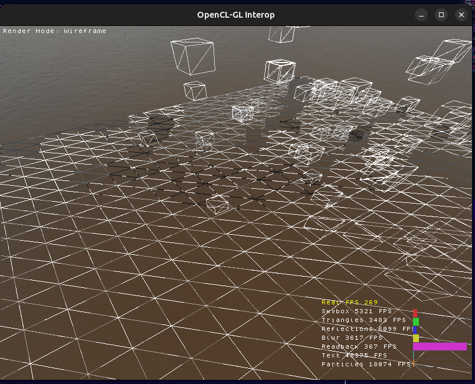
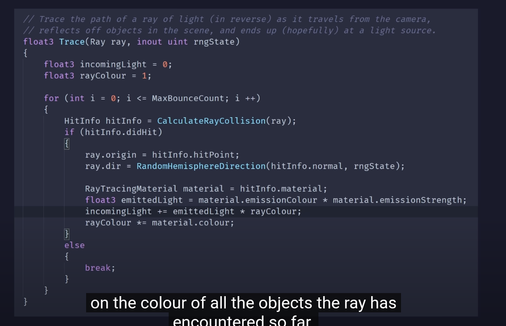
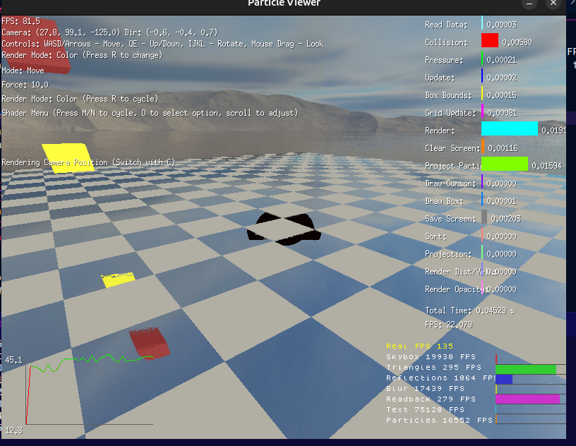

# Binary Frame Read/Write Performance Test

This experiment tests the performance of writing and reading frame data as binary files using Go. The test simulates rendering a frame (800x600x3 bytes) and measures the read/write speeds and frame rates.

## Test Specifications
- Frame dimensions: 800x600 pixels
- Color depth: 3 bytes per pixel (RGB)
- Total frame size: 1,440,000 bytes (~1.44MB)

## Performance Results

### Write Performance
- Speed: 636.30 MB/s
- Frame write time: 2,263,080 ns (~2.26ms)
- Write FPS: 441.88 frames/second

### Read Performance
- Speed: 388.02 MB/s
- Frame read time: 3,711,145 ns (~3.71ms)
- Read FPS: 269.46 frames/second

## Conclusion
The results show that writing frames is faster than reading them, with write operations capable of handling ~442 FPS while read operations can handle ~269 FPS. This suggests that the system could theoretically handle real-time frame processing for applications requiring up to 60 FPS.

### 3. UI Overlay
- Render text & charts into a temp buffer  
- Copy buffer → GL texture → screen overlay  
  
## TODO - Base on prioritys in missile as in irst so it will need multiple successful lock to track target
- [ ] missile avoidence and collision on cpu based on triangle collision optimalization check for colision only in correct chunk
- [ ] make seaker work with flares
- [ ] add render / add functionality to lunch flares 
- [ ] scale everything to real life scale (1.0f = 1.0 meter)
- [ ] Add planes and misiles
  - [X] render heat in separate buffer
    - [ ] add data link
- [ ] Fix wire frame ghosting 
- [ ] Add Antialiasing
  - [X] Normals to enhance it
  - [X] Modified Antialiasing to be dynamic based on render mode
  - [ ] Add TAA
    - [ ] Previous frame buffer
  - [X] Add option to enable disable Antialiasing during run
    - [X] Add text rendering
  - [ ] Add Timings
- [ ] BVH c Implementation
- [ ] Trace Ray Function prototype 
  - [ ] implemented it on your own
    - [ ] Finish raytracing kernel
      - [ ] Initialize kernel
        - [ ] BVH buffer ...
- [ ] Fix Timings
  - [ ] Add More Timings
    - [ ] Marge It to one struct make it more dynamic mainly the open cl code
      - [ ] Add timing for rendering of UI
      - [ ] Add timings for simulations
- [ ] Distance image normalization
  - [ ] Particle Sim
  - [ ] Triangles
  - [ ] *Note* save real values then before uploading image to Open GL normalize it
- [ ] Fix C reading and writing of BVH / open CL code
  - [ ] Read BVH in C
- [ ] Fix C reading and writing of BVH / open CL code
- [ ] convert timing to this format

  ```c
  struct timespec start, end;
  clock_gettime(CLOCK_MONOTONIC, &start);
  saveScreenNormal(screen, "normal.bin");
  clock_gettime(CLOCK_MONOTONIC, &end);
  double ms = (end.tv_sec - start.tv_sec) * 1000.0 + (end.tv_nsec - start.tv_nsec) / 1e6;
  ```
- [ ] Better screen space reflections (Ray Tracing)
  - [ ] add shadows (with ray tracing)
- [ ] (Look Into) Fix .obj file parsing
- [ ] Update timimg (CPU)
- [ ] add emission and bloom
  - [ ] ***Note** can be handled with ray tracing
  - [ ] ***Optional*** add cnn to denoise ray tracer inmplement it in openCL to make it fast
- [ ] render fluid in c (open gl) and openCL ([link](https://tympanus.net/codrops/2025/02/26/webgpu-fluid-simulations-high-performance-real-time-rendering/))
- [ ] Add Setting for fluid with GUI -> **Not Important For Now**

### Add Open GL to the go code to project particles on GPU directly
- Render headlessly the image and save it in the to drive so the go code can read it
- [ ] implement

### Not sure what i meant
- [ ] Move fire sim to same open cl structure -> ***not sure what i meant***
  - [ ] Try it again

### Add better timing
- [ ] add timing
- [ ] test timing why i get so weird numbers

### Threading and Performance [ ***BackLog*** ]
- [ ] Implement simulation and rendering in different threads
  - Render thread should run at a fixed rate (e.g., 24 FPS)
  - Lock simulation thread when scene is being rendered
  - Run simulation as fast as possible, but adjust step size based on TPS (higher TPS = smaller simulation steps)
- [ ] why pragma opm is not helping

### Graphics Enhancement
- [X] Accelerate rendering with CUDA -> **Using OpenCl/GL for it**
- [ ] add screens based fluid rendering

### DONE
- [X] render wide view from position and direction of missile for check of collision
- [X] set up the githup copilot rules **https://docs.github.com/en/copilot/how-tos/configure-custom-instructions/add-repository-instructions?tool=visualstudio**
- [X] render all in open gl remove memory sharing with go code
- [X] Add Pause
  - [X] Add Text rendering
- [X] misslie view display
- [X] missiel lunch ( lock -> lunch -> if loss lock scan -> target )
- [X] Move guidanceGain to missile struct
- [X] Simulate fluid on gpu move the code to separate file
- [X] fire sim
```c
  type Particles struct {
      float posX[count]
      float posY[count]
      float posZ[count]
      float velX[count]
      float velY[count]
      float velZ[count]
      float lifeTime[count]
      float basePos[3]
      float baseColor[3]
      float fireColor[3]
      float SmokeColor[3]
      float maxLifeTime
      Size  float
    }
```
  - [X] run on gpu -> **keeped on CPU for now**
    - [X] move up with some random side wiggle
    - [X] render color based on the lifetime lerp between base color -> fire color -> smoke color
  -   [X] when life time is bigger then reset position and life time
  - [X] integrate it to main file
    - [X] add it to render modes
- [X] add CohesionForce, ViscosityForce
- [X] Remove CPU read backs
- [X] Draw Bounding Box Around the particles
- [X] Velocity normalization Particles
- [X] Move Physis to separate file
  - [X] Make test how fast it can be
    - **Run 15000 particles**
        Simulated 100 frames in 0.441 seconds
        Average time per frame: 4.414 ms
        Average TPS: 226.56
        Number of particles: 15000
        Average particle simulation time: 0.294 microseconds
    - **Run 25000 particles**
        Simulated 100 frames in 0.592 seconds
        Average time per frame: 5.921 ms
        Average TPS: 168.90
        Number of particles: 25000
        Average particle simulation time: 0.237 microseconds
    - **Run 50000 particles**
        Simulated 100 frames in 1.053 seconds
        Average time per frame: 10.528 ms
        Average TPS: 94.98
        Number of particles: 50000
        Average particle simulation time: 0.211 microseconds
    - **Run 100000 particles**
        Simulated 100 frames in 2.093 seconds
        Average time per frame: 20.926 ms
        Average TPS: 47.79
        Number of particles: 100000
        Average particle simulation time: 0.209 microseconds
  - [X] improve collisions to do them in sub ticks
  - [X] apply pressure force from center of mass of the cell
  - [ ] ***Optional*** move fluid sim to another thread
- [X] Add UI to each render mode
  - [X] Initialize Buffers
  - [X] render ui in separate buffer as overlay
    - [X] render mode into UI buffer
    - [X] Modify text and graph rendering functions to accept optional render buffer parameter (defaults to screen color buffer if not specified)
- [X] initialize infrastructure for ***renderTextImage**
  - [X] do not do it just do it in temp buffer and copy it to texture
    - [X] add generic fuction to copy data from buffer to texture
- [X] WTF
  - [X] Reading BVH: 6519 nodes, 3260 triangles
BVH loaded successfully: 6519 nodes, 3260 triangles
BVH loaded with 6519 nodes and 3260 triangles
Loading font: 128x112 pixels
Font loaded successfully: 14336 pixels
SkyBox loaded successfully
Triangles count after reading: 0
Triangles written to parseObj/triangles.bin successfully
File size: 247768 bytes
Triangle count: 3260
Skybox buffers initialized successfully
Uploading triangle data once: 3260 triangles
Triangle data uploaded successfully
OpenCL-GL interop initialized successfully
***Error setting RenderText kernel arguments: -38***
***Error setting gpuTimings kernel arguments: -38***
Saved normals (shared mem) in 2.368 ms
Saved colors (shared mem) in 2.063 ms
FPS: 10.51, TPS: 2.70, Update: 0.00 s, Render: 0.09 s
***Error writing points buffer: -5***
***Error writing velocities buffer: -5***
***Error writing posX: -5***
***Error setting gpuTimings kernel arguments: -38***
- [X] Init Open Gl
  - [X] Example Code
  ```c
  #include <GLFW/glfw3.h>
  #include <stdio.h>

  // Size of your image
  #define WIDTH 800
  #define HEIGHT 400

  // Dummy image data
  float imageData[WIDTH * HEIGHT * 4];

  void fillTestData() {
      for (int y = 0; y < HEIGHT; y++) {
          for (int x = 0; x < WIDTH; x++) {
              int idx = (y * WIDTH + x) * 4;
              imageData[idx + 0] = (float)x / WIDTH;   // R
              imageData[idx + 1] = (float)y / HEIGHT;  // G
              imageData[idx + 2] = 0.2f;               // B
              imageData[idx + 3] = 1.0f;               // A
          }
      }
  }

  int main() {
      if (!glfwInit()) {
          fprintf(stderr, "Failed to init GLFW\n");
          return -1;
      }

      GLFWwindow* window = glfwCreateWindow(WIDTH, HEIGHT, "Texture Viewer", NULL, NULL);
      if (!window) {
          fprintf(stderr, "Failed to create window\n");
          glfwTerminate();
          return -1;
      }

      glfwMakeContextCurrent(window);

      // Fill with dummy gradient data
      fillTestData();

      // Generate and upload texture
      GLuint texID;
      glGenTextures(1, &texID);
      glBindTexture(GL_TEXTURE_2D, texID);

      // Important: using GL_RGBA32F because data is float32
      glTexImage2D(GL_TEXTURE_2D, 0, GL_RGBA32F, WIDTH, HEIGHT, 0, GL_RGBA, GL_FLOAT, imageData);

      // Simple nearest-neighbor filtering
      glTexParameteri(GL_TEXTURE_2D, GL_TEXTURE_MIN_FILTER, GL_NEAREST);
      glTexParameteri(GL_TEXTURE_2D, GL_TEXTURE_MAG_FILTER, GL_NEAREST);

      // Main loop
      while (!glfwWindowShouldClose(window)) {
          glClear(GL_COLOR_BUFFER_BIT);

          // Draw fullscreen quad with immediate mode (for simplicity)
          glEnable(GL_TEXTURE_2D);
          glBindTexture(GL_TEXTURE_2D, texID);

          glBegin(GL_QUADS);
              glTexCoord2f(0.0f, 0.0f); glVertex2f(-1.0f, -1.0f);
              glTexCoord2f(1.0f, 0.0f); glVertex2f( 1.0f, -1.0f);
              glTexCoord2f(1.0f, 1.0f); glVertex2f( 1.0f,  1.0f);
              glTexCoord2f(0.0f, 1.0f); glVertex2f(-1.0f,  1.0f);
          glEnd();

          glfwSwapBuffers(window);
          glfwPollEvents();
      }

      glDeleteTextures(1, &texID);
      glfwDestroyWindow(window);
      glfwTerminate();
      return 0;
  }
  ```
  - [X] Render Image as Texture
- [X] Move interactions to c
  - [X] movement
  - [X] mouse control
  - [X] render mode
    - [X] change render normal, color, distance ...
    - [X] update the rendered frame based on render mode
  ```c
  #include <GLFW/glfw3.h>
  #include <stdio.h>
  
  void key_callback(GLFWwindow* window, int key, int scancode, int action, int mods) {
      if (action == GLFW_PRESS) {   // when key is pressed
          switch (key) {
              case GLFW_KEY_ESCAPE:
                  printf("ESC pressed, closing window\n");
                  glfwSetWindowShouldClose(window, 1);
                  break;
              case GLFW_KEY_W:
                  printf("W pressed\n");
                  break;
              case GLFW_KEY_A:
                  printf("A pressed\n");
                  break;
              case GLFW_KEY_S:
                  printf("S pressed\n");
                  break;
              case GLFW_KEY_D:
                  printf("D pressed\n");
                  break;
          }
      }
      else if (action == GLFW_RELEASE) {
          // optional: handle key release
      }
  }
  
  int main() {
      if (!glfwInit()) return -1;
  
      GLFWwindow* window = glfwCreateWindow(800, 600, "OpenGL Window", NULL, NULL);
      if (!window) {
          glfwTerminate();
          return -1;
      }
  
      glfwMakeContextCurrent(window);
  
      // set callback
      glfwSetKeyCallback(window, key_callback);
  
      while (!glfwWindowShouldClose(window)) {
          glClear(GL_COLOR_BUFFER_BIT);
  
          // rendering here...
  
          glfwSwapBuffers(window);
          glfwPollEvents();  // process input
      }
  
      glfwDestroyWindow(window);
      glfwTerminate();
      return 0;
  }```
- [X] Wire Frame
  - [X] add option to change the mode
  - [X] initialize it buffers
  - [X] write kernel code
- [X] (Not For Now) Render in C code do not save to file
  - [X] (To Do) Write to shared memory - share image as shared memory
- [X] Fix BVH Lineation
- [X] Fix hole in in middle of screen space reflections 
- [X] Add chart for gpu timing
- [X] Add Timing for rendering of particles
- [X] Add Text Color
- [X] New Triangle Renderer ([link](https://chatgpt.com/c/6878486d-ee08-8004-b21e-31c714a8479f))
- [X] Add text support
- [X] GPU Timeing
  - [X] renderSkyBoxTime;
  - [X] renderTrianglesTime;
  - [X] applyReflectionsTime;
  - [X] applyBlurTime;
  - [X] readBackTime;
- [X] Triangles are static, we can upload them once and reuse them
- [X] Screen Space Reflections ( general purpose function where you provide image ray and it will return color )
- [X] add go code to parse obj files
- [X] add skybox directly to the render triangles shader so i can sample the sky box to get realistic reflections of sky
- [X] implement multithreading (project particles in diffrent threads)
- [x] rework it to work based on grid
- [x] particle grid based on the Sebastian's video https://m.youtube.com/watch?v=pLwYMecqOxY
- [X] more realistic attraction and repulsion
- [X] optimized the sorting of the particles
- [X] Update the MP code
- [X] Encode more data to the images for better fluid rendering
- [X] Build Rasterize - 3D
- [X] Idea we can render based on distance buffer we don't need to sort
- [X] add sky box and the ground
  - [X] get sky box textures and load it
  - [X] crete check board ground
